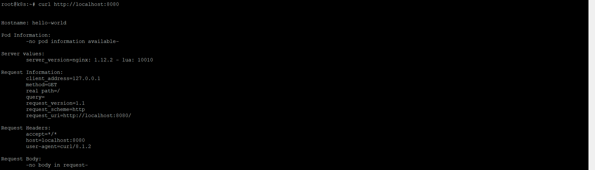
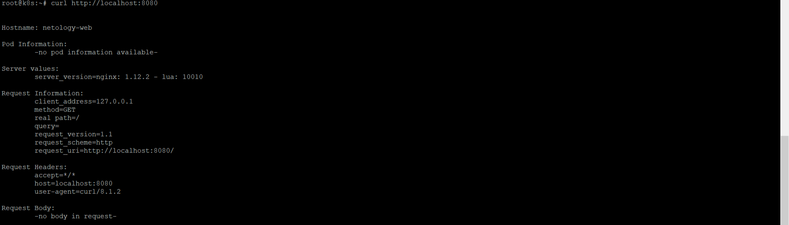

# Домашнее задание к занятию «Базовые объекты K8S», Лебедев А.И., FOPS-10

### Цель задания

В тестовой среде для работы с Kubernetes, установленной в предыдущем ДЗ, необходимо развернуть Pod с приложением и подключиться к нему со своего локального компьютера. 

------

### Чеклист готовности к домашнему заданию

1. Установленное k8s-решение (например, MicroK8S).
2. Установленный локальный kubectl.
3. Редактор YAML-файлов с подключенным Git-репозиторием.

------

### Инструменты и дополнительные материалы, которые пригодятся для выполнения задания

1. Описание [Pod](https://kubernetes.io/docs/concepts/workloads/pods/) и примеры манифестов.
2. Описание [Service](https://kubernetes.io/docs/concepts/services-networking/service/).

------  

# Выполнение:  


### Задание 1. Создать Pod с именем hello-world

1. Создать манифест (yaml-конфигурацию) Pod.

2. Использовать image - gcr.io/kubernetes-e2e-test-images/echoserver:2.2.

Создадим `my-pod.yaml` с использованием образа `gcr.io/kubernetes-e2e-test-images/echoserver:2.2`, согласно условиям задания
```
apiVersion: v1
kind: Pod
metadata:
  name: hello-world
spec:
  containers:
    - name: echoserver-container
      image: gcr.io/kubernetes-e2e-test-images/echoserver:2.2
```


3. Подключиться локально к Pod с помощью `kubectl port-forward` и вывести значение (curl или в браузере).

```
microk8s kubectl apply -f pod.yaml
microk8s kubectl get pods
```



------

### Задание 2. Создать Service и подключить его к Pod

1. Создать Pod с именем netology-web.
2. Использовать image — gcr.io/kubernetes-e2e-test-images/echoserver:2.2.
3. Создать Service с именем netology-svc и подключить к netology-web.

Объединим несколько заданий. В итоге, у нас получается вот такой *.yaml:    


```
apiVersion: v1
kind: Service
metadata:
  name: netology-svc
spec:
  selector:
    app: netology-web
  ports:
    - protocol: TCP
      port: 80
      targetPort: 8080

---

apiVersion: v1
kind: Pod
metadata:
  name: netology-web
  labels:
    app: netology-web
spec:
  containers:
    - name: echoserver-container
      image: gcr.io/kubernetes-e2e-test-images/echoserver:2.2

```


Применяем изменения  


```
microk8s kubectl apply -f netology-web.yaml
```

4. Подключиться локально к Service с помощью `kubectl port-forward` и вывести значение (curl или в браузере).




------

