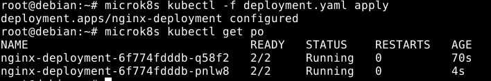
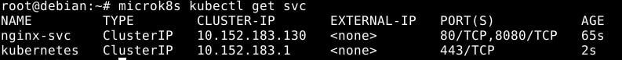
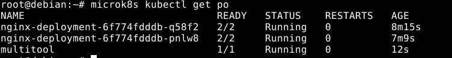
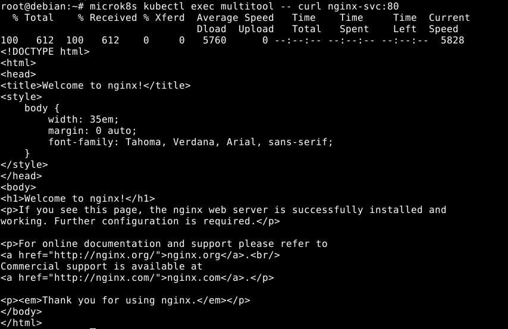
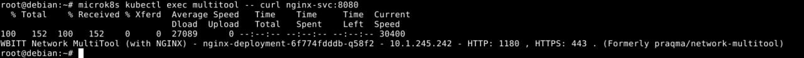
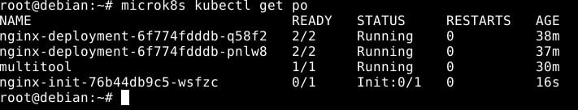
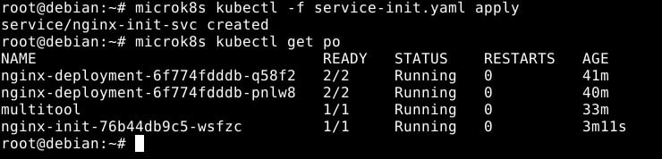

# Домашнее задание к занятию «Запуск приложений в K8S», Лебедев А.И., FOPS-10

### Цель задания

В тестовой среде для работы с Kubernetes, установленной в предыдущем ДЗ, необходимо развернуть Deployment с приложением, состоящим из нескольких контейнеров, и масштабировать его.

------

### Чеклист готовности к домашнему заданию

1. Установленное k8s-решение (например, MicroK8S).
2. Установленный локальный kubectl.
3. Редактор YAML-файлов с подключённым git-репозиторием.

------

### Инструменты и дополнительные материалы, которые пригодятся для выполнения задания

1. [Описание](https://kubernetes.io/docs/concepts/workloads/controllers/deployment/) Deployment и примеры манифестов.
2. [Описание](https://kubernetes.io/docs/concepts/workloads/pods/init-containers/) Init-контейнеров.
3. [Описание](https://github.com/wbitt/Network-MultiTool) Multitool.

------

### Задание 1. Создать Deployment и обеспечить доступ к репликам приложения из другого Pod

1. Создать Deployment приложения, состоящего из двух контейнеров — nginx и multitool. Решить возникшую ошибку.
2. После запуска увеличить количество реплик работающего приложения до 2.
3. Продемонстрировать количество подов до и после масштабирования.
4. Создать Service, который обеспечит доступ до реплик приложений из п.1.
5. Создать отдельный Pod с приложением multitool и убедиться с помощью `curl`, что из пода есть доступ до приложений из п.1.

------

### Задание 2. Создать Deployment и обеспечить старт основного контейнера при выполнении условий

1. Создать Deployment приложения nginx и обеспечить старт контейнера только после того, как будет запущен сервис этого приложения.
2. Убедиться, что nginx не стартует. В качестве Init-контейнера взять busybox.
3. Создать и запустить Service. Убедиться, что Init запустился.
4. Продемонстрировать состояние пода до и после запуска сервиса.

------

### Выполнение:    

## Задание 1.

- Необходимо задать альтернативный порт для **multitool** для запуска контейнеров, также, сразу увеличим количество реплик до двух.
- **deployment.yaml**:

```
apiVersion: apps/v1
kind: Deployment
metadata:
  name: nginx-deployment
  labels:
    app: nginx
spec:
  replicas: 2
  selector:
    matchLabels:
      app: nginx
  template:
    metadata:
      labels:
        app: nginx
    spec:
      containers:
      - name: nginx
        image: nginx:1.14.2
        ports:
        - containerPort: 80
      - name: multitool
        image: wbitt/network-multitool
        ports:
        - containerPort: 8080
        env: 
         - name: HTTP_PORT
           value: "1180"
```



- Создаем червис с доступом и отдельный **pod**.

- **service.yaml**:

```
apiVersion: v1
kind: Service
metadata:
  name: nginx-svc
spec:
  selector:
    app: nginx
  ports:
    - protocol: TCP
      name: nginx
      port: 80
      targetPort: 80    
    - protocol: TCP
      name: multitool
      port: 8080
      targetPort: 1180
```

- **multitool.yaml**:

```
apiVersion: v1
kind: Pod
metadata:
   name: multitool
spec:
   containers:
     - name: multitooly_init
       image: wbitt/network-multitool
       ports:
        - containerPort: 8080
```

  

    

- Curl:

  

  

## Задание 2.  

- В соответствие с условием, опишем несколько ямл-файлов и назовем их deploy_init & service_init:

- **deploy_init.yaml**:

```
apiVersion: apps/v1
kind: Deployment
metadata:
  name: nginx-init
spec:
  selector:
    matchLabels:
      app: nginx-init
  replicas: 1
  template:
    metadata:
      labels:
        app: nginx-init
    spec:
      containers:
      - name: nginx
        image: nginx:1.14.2
        ports:
        - containerPort: 80
      initContainers:
      - name: delay
        image: busybox
        command: ['sh', '-c', "until nslookup nginx-init-svc.$(cat /var/run/secrets/kubernetes.io/serviceaccount/namespace).svc.cluster.local; do echo waiting for nginx-init-svc; sleep 2; done"]
```

- **service_init.yaml**:

```
apiVersion: v1
kind: Service
metadata:
  name: nginx-init-svc
spec:
  ports:
    - name: nginx-init
      port: 80
  selector:
    app: nginx-init
```

  

  

---
