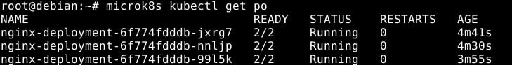
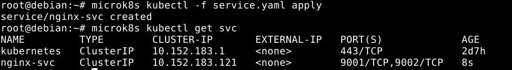
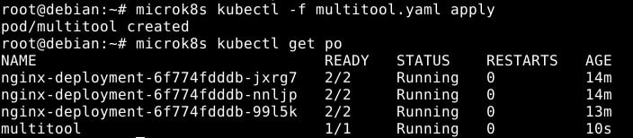
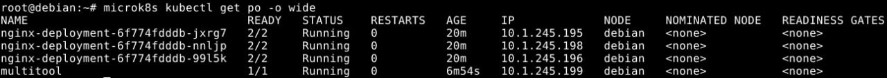
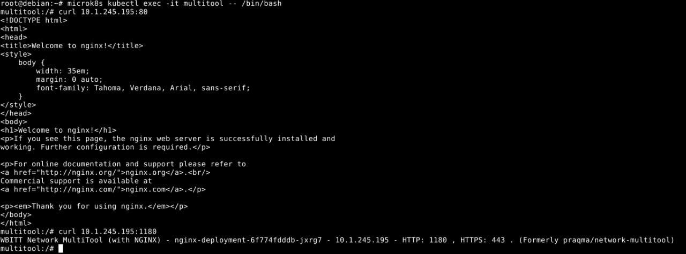
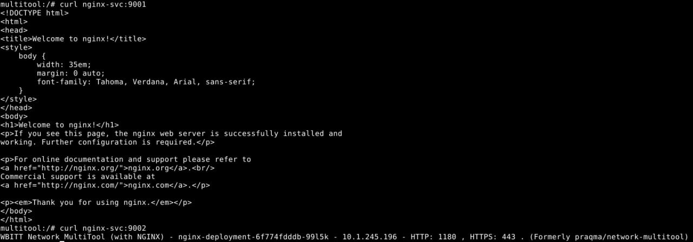
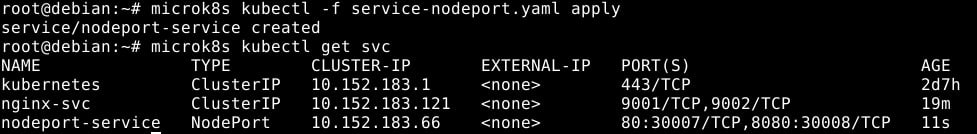
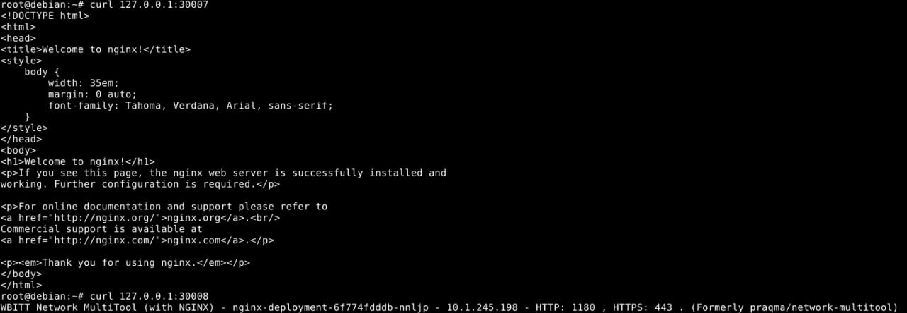

# Домашнее задание к занятию «Сетевое взаимодействие в K8S. Часть 1», Лебедев А.И., FOPS-10

### Цель задания

В тестовой среде Kubernetes необходимо обеспечить доступ к приложению, установленному в предыдущем ДЗ и состоящему из двух контейнеров, по разным портам в разные контейнеры как внутри кластера, так и снаружи.

------

### Чеклист готовности к домашнему заданию

1. Установленное k8s-решение (например, MicroK8S).
2. Установленный локальный kubectl.
3. Редактор YAML-файлов с подключённым Git-репозиторием.

------

### Инструменты и дополнительные материалы, которые пригодятся для выполнения задания

1. [Описание](https://kubernetes.io/docs/concepts/workloads/controllers/deployment/) Deployment и примеры манифестов.
2. [Описание](https://kubernetes.io/docs/concepts/services-networking/service/) Описание Service.
3. [Описание](https://github.com/wbitt/Network-MultiTool) Multitool.

------

### Задание 1. Создать Deployment и обеспечить доступ к контейнерам приложения по разным портам из другого Pod внутри кластера

1. Создать Deployment приложения, состоящего из двух контейнеров (nginx и multitool), с количеством реплик 3 шт.
2. Создать Service, который обеспечит доступ внутри кластера до контейнеров приложения из п.1 по порту 9001 — nginx 80, по 9002 — multitool 8080.
3. Создать отдельный Pod с приложением multitool и убедиться с помощью `curl`, что из пода есть доступ до приложения из п.1 по разным портам в разные контейнеры.
4. Продемонстрировать доступ с помощью `curl` по доменному имени сервиса.
5. Предоставить манифесты Deployment и Service в решении, а также скриншоты или вывод команды п.4.

------

### Задание 2. Создать Service и обеспечить доступ к приложениям снаружи кластера

1. Создать отдельный Service приложения из Задания 1 с возможностью доступа снаружи кластера к nginx, используя тип NodePort.
2. Продемонстрировать доступ с помощью браузера или `curl` с локального компьютера.
3. Предоставить манифест и Service в решении, а также скриншоты или вывод команды п.2.

------

### Выполнение:    

## Задание 1

- Отредактируем **deployment.yaml** и выставим количество реплик - 3:

```
apiVersion: apps/v1
kind: Deployment
metadata:
  name: nginx-deployment
  labels:
    app: nginx
spec:
  replicas: 3
  selector:
    matchLabels:
      app: nginx
  template:
    metadata:
      labels:
        app: nginx
    spec:
      containers:
      - name: nginx
        image: nginx:1.14.2
        ports:
        - containerPort: 80
      - name: multitool
        image: wbitt/network-multitool
        ports:
        - containerPort: 8080
        env: 
         - name: HTTP_PORT
           value: "1180"
```

- также, согласно задания, создадим **service.yaml** & **multitool.yaml**:

```
apiVersion: v1
kind: Service
metadata:
  name: nginx-svc
spec:
  selector:
    app: nginx
  ports:
    - protocol: TCP
      name: nginx
      port: 9001
      targetPort: 80    
    - protocol: TCP
      name: multitool
      port: 9002
      targetPort: 1180
```

```
apiVersion: v1
kind: Pod
metadata:
   name: multitool
spec:
   containers:
     - name: multitool
       image: wbitt/network-multitool
       ports:
        - containerPort: 8080
```

- Проверим работу наших pod'ов:

  

  

  

- Данная часть задания очень похожа на предыдущий модуль. Выполнис команду, которая показывает больше информации о наших pod'ах и выполним curl:

  

   

 

## Задание 2  

- Создадим отдельный сервис nodeport в **nodeport.yaml**:

```
apiVersion: v1
kind: Service
metadata:
  name: nodeport-service
spec:
  type: NodePort
  selector:
    app: nginx
  ports:
    - port: 80
      name: nginx-port
      targetPort: 80
      nodePort: 30007
    - port: 8080
      name: multitool-port
      targetPort: 1180
      nodePort: 30008
```

- Проверим, что у нас там происходит:

   

  

---


