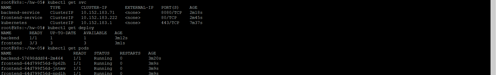
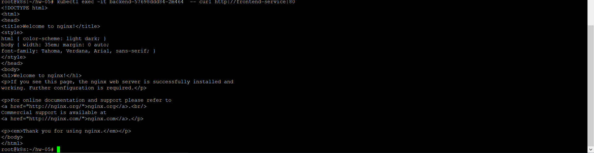
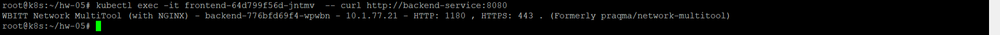
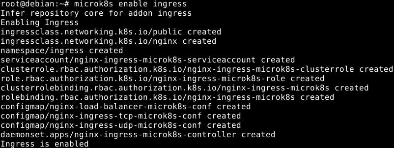

# Домашнее задание к занятию «Сетевое взаимодействие в K8S. Часть 2», Лебедев А.И., FOPS-10

### Цель задания

В тестовой среде Kubernetes необходимо обеспечить доступ к двум приложениям снаружи кластера по разным путям.

------

### Чеклист готовности к домашнему заданию

1. Установленное k8s-решение (например, MicroK8S).
2. Установленный локальный kubectl.
3. Редактор YAML-файлов с подключённым Git-репозиторием.

------

### Инструменты и дополнительные материалы, которые пригодятся для выполнения задания

1. [Инструкция](https://microk8s.io/docs/getting-started) по установке MicroK8S.
2. [Описание](https://kubernetes.io/docs/concepts/services-networking/service/) Service.
3. [Описание](https://kubernetes.io/docs/concepts/services-networking/ingress/) Ingress.
4. [Описание](https://github.com/wbitt/Network-MultiTool) Multitool.

------

### Задание 1. Создать Deployment приложений backend и frontend

1. Создать Deployment приложения _frontend_ из образа nginx с количеством реплик 3 шт.
2. Создать Deployment приложения _backend_ из образа multitool. 
3. Добавить Service, которые обеспечат доступ к обоим приложениям внутри кластера. 
4. Продемонстрировать, что приложения видят друг друга с помощью Service.
5. Предоставить манифесты Deployment и Service в решении, а также скриншоты или вывод команды п.4.

------

### Задание 2. Создать Ingress и обеспечить доступ к приложениям снаружи кластера

1. Включить Ingress-controller в MicroK8S.
2. Создать Ingress, обеспечивающий доступ снаружи по IP-адресу кластера MicroK8S так, чтобы при запросе только по адресу открывался _frontend_ а при добавлении /api - _backend_.
3. Продемонстрировать доступ с помощью браузера или `curl` с локального компьютера.
4. Предоставить манифесты и скриншоты или вывод команды п.2.

------  

### Выполнение:  

## Задание 1.  

------

### Задание 1. Создать Deployment приложений backend и frontend

-  Создать Deployment приложения _frontend_ из образа nginx с количеством реплик 3 шт.

Конфигурация **frontend.yaml**
```yml
apiVersion: apps/v1
kind: Deployment
metadata:
  name: frontend
spec:
  replicas: 3
  selector:
    matchLabels:
      app: frontend
  template:
    metadata:
      labels:
        app: frontend
    spec:
      containers:
      - name: nginx-container
        image: nginx:1.26.0
        ports:
        - containerPort: 80
```

-  Создать Deployment приложения _backend_ из образа multitool. 

Конфигурация **backend.yaml**
```yml
apiVersion: apps/v1
kind: Deployment
metadata:
  name: backend
spec:
  replicas: 1
  selector:
    matchLabels:
      app: backend
  template:
    metadata:
      labels:
        app: backend
    spec:
      containers:
      - name: multitool-container
        image: wbitt/network-multitool:latest
        ports:
        - containerPort: 8080
        env:
        - name: HTTP_PORT
          value: "1180"
```

-  Добавить Service, которые обеспечат доступ к обоим приложениям внутри кластера. 

Конфигурация **service_frontend.yaml** для нашего frontend приложения с nginx
```yml
apiVersion: v1
kind: Service
metadata:
  name: frontend-service
spec:
  selector:
    app: frontend
  ports:
    - protocol: TCP
      port: 80
      targetPort: 80
```

Конфигурация **service_backend.yaml** для нашего backend приложения с multitool
```yml
apiVersion: v1
kind: Service
metadata:
  name: backend-service
spec:
  selector:
    app: backend
  ports:
    - protocol: TCP
      port: 8080
      targetPort: 8080
```

-  Продемонстрировать, что приложения видят друг друга с помощью Service.

- Обновляем сертификаты 
```
microk8s  refresh-certs --cert ca.crt
```

- Деплоим приложения и поднимаем сервисы 
```
kubectl apply -f backend.yaml
kubectl apply -f frontend.yaml
kubectl apply -f service_backend.yaml
kubectl apply -f service_frontend.yaml
```

- Проверяем успешность запуска
```
kubectl get svc
kubectl get deploy
kubectl get pods
```



- Проверяем, что приложения друг друга видят
```
kubectl exec -it backend-57698ddd84-2m464  -- curl http://frontend-service:80
```



```
kubectl exec -it frontend-64d799f56d-jntmv  -- curl http://backend-service:8080
```

  

## Задание 2.    

- Используя microk8s, включим Ingress

  

Конфигурация **ingress.yaml**:  

```
apiVersion: networking.k8s.io/v1
kind: Ingress
metadata:
  name: my-ingress
  annotations:
    nginx.ingress.kubernetes.io/rewrite-target: /
spec:
  ingressClassName: nginx
  rules:
  - host: localhost
    http:
      paths:
      - path: /api
        pathType: Prefix
        backend:
          service:
            name: backend-service
            port:
              number: 8080
      - path: /
        pathType: Prefix
        backend:
          service:
            name: frontend-service
            port:
              number: 80
```


