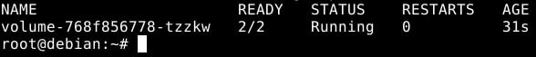
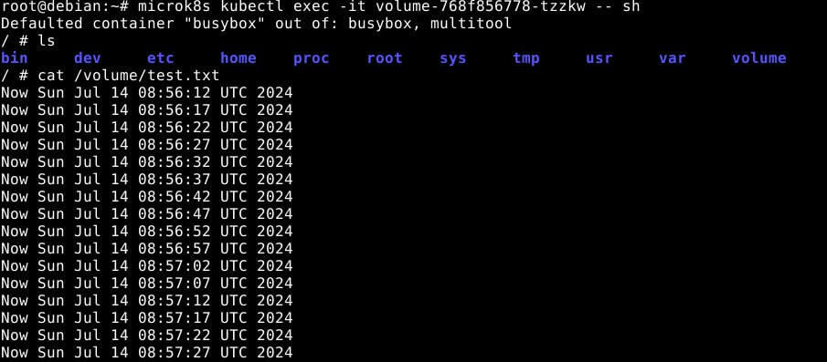
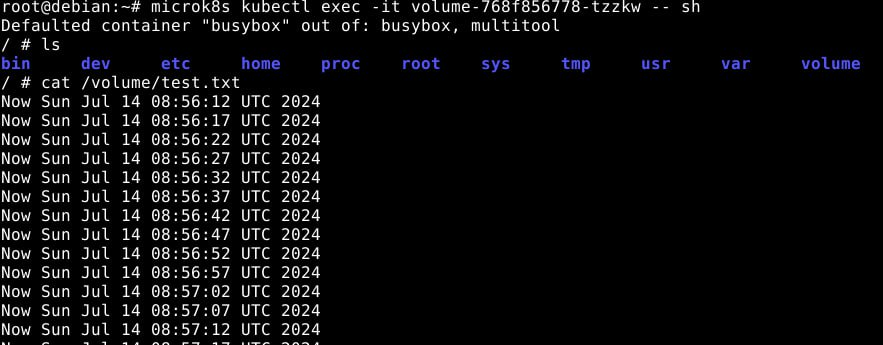
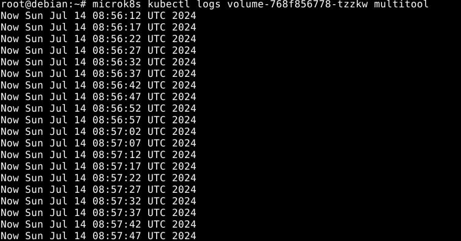
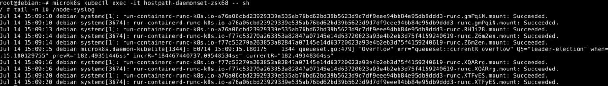

# Домашнее задание к занятию «Хранение в K8s. Часть 1», Лебедев А.И., FOPS-10

### Цель задания

В тестовой среде Kubernetes нужно обеспечить обмен файлами между контейнерам пода и доступ к логам ноды.

------

### Чеклист готовности к домашнему заданию

1. Установленное K8s-решение (например, MicroK8S).
2. Установленный локальный kubectl.
3. Редактор YAML-файлов с подключенным GitHub-репозиторием.

------

### Дополнительные материалы для выполнения задания

1. [Инструкция по установке MicroK8S](https://microk8s.io/docs/getting-started).
2. [Описание Volumes](https://kubernetes.io/docs/concepts/storage/volumes/).
3. [Описание Multitool](https://github.com/wbitt/Network-MultiTool).

------

### Задание 1 

**Что нужно сделать**

Создать Deployment приложения, состоящего из двух контейнеров и обменивающихся данными.

1. Создать Deployment приложения, состоящего из контейнеров busybox и multitool.
2. Сделать так, чтобы busybox писал каждые пять секунд в некий файл в общей директории.
3. Обеспечить возможность чтения файла контейнером multitool.
4. Продемонстрировать, что multitool может читать файл, который периодоически обновляется.
5. Предоставить манифесты Deployment в решении, а также скриншоты или вывод команды из п. 4.

------

### Задание 2

**Что нужно сделать**

Создать DaemonSet приложения, которое может прочитать логи ноды.

1. Создать DaemonSet приложения, состоящего из multitool.
2. Обеспечить возможность чтения файла `/var/log/syslog` кластера MicroK8S.
3. Продемонстрировать возможность чтения файла изнутри пода.
4. Предоставить манифесты Deployment, а также скриншоты или вывод команды из п. 2.

------  

# Выполнение:  

- Создаем Deployment приложения, состоящего из контейнеров busybox и multitool, который будет соответствовать всем условиям задачи:

**deployment.yaml**  

```
apiVersion: apps/v1
kind: Deployment
metadata:
  name: volume
spec:
  selector:
    matchLabels:
      app: volume
  replicas: 1
  template:
    metadata:
      labels:
        app: volume
    spec:
      containers:
      - name: busybox
        image: busybox:1.28
        command: ['sh', '-c', 'while true; do echo "Now $(date)" >> /volume/test.txt; sleep 5; done']
        volumeMounts:
        - name: volume
          mountPath: /volume
      - name: multitool
        image: wbitt/network-multitool
        command: ['sh', '-c', 'tail -f /test/test.txt']
        volumeMounts:
        - name: volume
          mountPath: /test		
      volumes:
      - name: volume
        emptyDir: {}
```



- Проверим, что файл пишется, доступен из обоих контейнеров и читается из контейнера multitool:

  

  

  

- Все отлично

- Сконфигурируем **daemonset.yaml**:

```
apiVersion: apps/v1
kind: DaemonSet
metadata:
  name: hostpath-daemonset
spec:
  selector:
    matchLabels:
      app: hostpath-daemonset
  template:
    metadata:
      labels:
        app: hostpath-daemonset
    spec:
      containers:
      - name: multitool
        image: wbitt/network-multitool
        volumeMounts:
        - name: node-syslog
          mountPath: /node-syslog
          readOnly: true
      volumes:
      - name: node-syslog
        hostPath:
          path: /var/log/syslog
```

 

- Основное отличие - тип **volume** выбран не **emptyDir**, а **hostPath**, так как в данном случае нам необходимо предоставить доступ к локальной файловой системе ноды.

- Проверяем:


  

---


