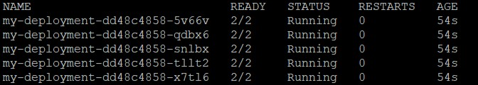
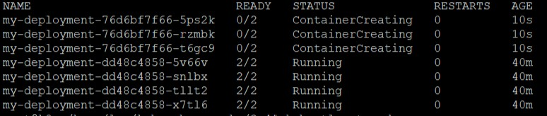
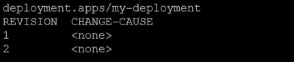
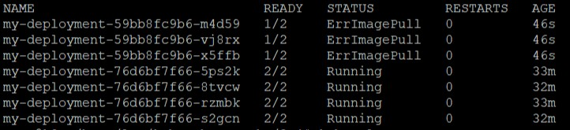
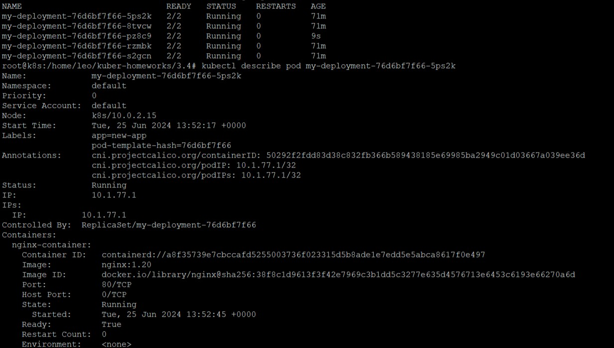
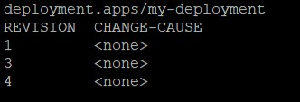

# Домашнее задание к занятию «Обновление приложений», Лебедев А.И., FOPS-10

### Цель задания

Выбрать и настроить стратегию обновления приложения.

### Чеклист готовности к домашнему заданию

1. Кластер K8s.

### Инструменты и дополнительные материалы, которые пригодятся для выполнения задания

1. [Документация Updating a Deployment](https://kubernetes.io/docs/concepts/workloads/controllers/deployment/#updating-a-deployment).
2. [Статья про стратегии обновлений](https://habr.com/ru/companies/flant/articles/471620/).

-----

### Задание 1. Выбрать стратегию обновления приложения и описать ваш выбор

1. Имеется приложение, состоящее из нескольких реплик, которое требуется обновить.
2. Ресурсы, выделенные для приложения, ограничены, и нет возможности их увеличить.
3. Запас по ресурсам в менее загруженный момент времени составляет 20%.
4. Обновление мажорное, новые версии приложения не умеют работать со старыми.
5. Вам нужно объяснить свой выбор стратегии обновления приложения.

### Задание 2. Обновить приложение

1. Создать deployment приложения с контейнерами nginx и multitool. Версию nginx взять 1.19. Количество реплик — 5.
2. Обновить версию nginx в приложении до версии 1.20, сократив время обновления до минимума. Приложение должно быть доступно.
3. Попытаться обновить nginx до версии 1.28, приложение должно оставаться доступным.
4. Откатиться после неудачного обновления.

# Выполнение:  

## Задание 1. Выбрать стратегию обновления приложения и описать ваш выбор:  

## Условия задачи:
- Приложение состоит из нескольких реплик.
- Обновление мажорное: новые версии несовместимы со старыми.
- Ресурсы ограничены, увеличить их невозможно.
- Запас по ресурсам в менее загруженное время — **20%**.

## Анализ ситуации:
1. **Несовместимость версий**:
   - Исключает использование стратегии **Blue-Green Deployment**, где обе версии работают параллельно.

2. **Ограниченные ресурсы**:
   - Нет возможности временно поддерживать обе версии.
   - Преимущество за стратегиями, обновляющими реплики постепенно.

3. **Запас по ресурсам**:
   - 20% резерва позволяют обновлять небольшое количество реплик поэтапно.

## Выбор стратегии: **Canary Deployment**
**Canary Deployment** предполагает постепенное обновление приложения с минимальным риском. На начальном этапе обновляется небольшое количество реплик (канареек), и их работа тщательно мониторится.

### Преимущества:
1. **Контроль рисков**:
   - Обновляется только часть приложения, что позволяет быстро откатиться в случае проблем.
   
2. **Экономия ресурсов**:
   - Используется только доступный запас ресурсов (20%).

3. **Мониторинг**:
   - Сбор метрик (например, через **Prometheus** и **Grafana**) позволяет проверить стабильность и корректность работы новой версии до полного обновления.

### Этапы реализации:
1. Обновить 1–2 реплики до новой версии.
2. Проверить их работу, используя мониторинг и логи.
3. Постепенно обновить оставшиеся реплики, отслеживая метрики и нагрузку.

## Альтернативный вариант: **Rolling Update**
Если Canary Deployment невозможен из-за особенностей приложения или инфраструктуры, можно использовать **Rolling Update**, который обновляет реплики поочередно. Однако этот подход менее безопасен, так как проблемы могут выявляться только на поздних этапах.

---

## Вывод:
**Canary Deployment** — оптимальный выбор в данной ситуации. Эта стратегия позволяет безопасно обновить приложение, избегая простоев и выходя за рамки выделенных ресурсов.    

### Задание 2. Выполнение:  

1. Создать deployment приложения с контейнерами nginx и multitool. Версию nginx взять 1.19. Количество реплик — 5.

Создаем файл **deployment.yaml**:  

  
```
apiVersion: apps/v1
kind: Deployment
metadata:
  name: my-deployment
spec:
  replicas: 5
  selector:
    matchLabels:
      app: new-app
  template:
    metadata:
      labels:
        app: new-app
    spec:
      containers:
      - name: nginx-container
        image: nginx:1.19
        ports:
        - containerPort: 80
      - name: multitool-container
        image: wbitt/network-multitool:latest
        ports:
        - containerPort: 8080
        env:
          - name: HTTP_PORT
            value: "1180"
```
Разворачиваем наш деплой и проверяем результат  

  
```
kubectl apply -f deployment.yaml
kubectl get deploy
kubectl get pods
```



Смотрим историю обновлений, аналогично примеру, показанному в лекции
```
kubectl rollout history deployment my-deployment
```



2. Обновить версию nginx в приложении до версии 1.20, сократив время обновления до минимума. Приложение должно быть доступно.

Заменяем версию **nginx**  c **1.19** до **1.20**, для чего корректируем данный блок кода в **deployment.yaml**
```
containers:
      - name: nginx-container
        image: nginx:1.20
```
Применяем изменения
```
kubectl apply -f deployment.yaml
```
Поскольку в конфигурации нашего приложения не прописана стратегия обновления, то применяется стандартная **rolling update**, которая заменяет одни поды (более старая версия приложения) на другие (более новая версия приложения).

Поды обновляются постепенно и наше приложение остается постоянно доступно





Проверяем, что появилась вторая версия прилоржения
```
kubectl rollout history deployment my-deployment
```


3. Попытаться обновить nginx до версии 1.28, приложение должно оставаться доступным.

Обновляемся аналогично предыдущему пункту
```
containers:
      - name: nginx-container
        image: nginx:1.28
```
Применяем извенения, хоть и знаем, что версии 1.28 не существует:
```
kubectl apply -f deployment.yaml
kubectl rollout history deployment my-deployment
```




Как видно, обновление завершилось ошибкой скачивания образа, но приложение осталось доступным на старой версии, благодаря дефолтной политике обновления.

4. Откатиться после неудачного обновления.
```
kubectl rollout undo deployment/my-deployment
```

Проверяем, что все поды в статусе **running**, а также то, что мы откатились к версии **1.20**
```
kubectl get po
kubectl describe pod my-deployment-76d6bf7f66-5ps2k
```


Проверяем, что появилась новая (четвертая) версия приложения, а вторая пропала, так как они идентичны.
```
kubectl rollout history deployment my-deployment
```

  

---


